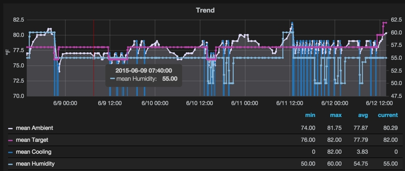

Den
===

Release v\ |version|.

``den`` is a home for your `Nest thermostat`_ data.

Features
--------

``den`` is built on the `Nest Developer Program`_ API.  It allows you to store
data from your thermostat(s) for greater analysis and visualization than the
`Nest web application`_ currently provides.  It records thermostat data to
`InfluxDB`_ where it can then be visualized with a dashboard tool like
`Grafana`_.

CLI Documentation
-----------------

.. argparse::
   :module: den.__main__
   :func: _get_parser
   :prog: run

API Documentation
-----------------

.. toctree::
   :maxdepth: 2

   api

Data Documentation
------------------

.. toctree::
   :maxdepth: 2

   data

Notebooks
---------

The `Jupyter`_ (née `IPython Notebook`_) project was used while developing
``den``.  The notebooks themselves are checked in to the `GitHub repository`_
and can be viewed there.

`Authorization`_

  How to generate the `access token`_ required by the `Nest API`_.

`API`_

  How to use Nest's `REST Streaming API`_.

`InfluxDB`_

  How to build on the `API`_ notebook and persist thermostat data to
  `InfluxDB`_.

Changelog
---------

.. toctree::
   :maxdepth: 2

   changelog

.. _Nest thermostat: https://nest.com/
.. _Nest Developer Program: https://developer.nest.com/
.. _Nest web application: https://home.nest.com/
.. _Jupyter: https://jupyter.org/
.. _IPython Notebook: http://ipython.org/notebook.html
.. _GitHub repository: https://github.com/krismolendyke/den
.. _Authorization: https://github.com/krismolendyke/den/blob/master/notebooks/Authorization.ipynb
.. _access token: https://developer.nest.com/documentation/cloud/how-to-auth#exchange-your-authorization-code-for-an-access-token
.. _Nest API: https://developer.nest.com/documentation/api-reference
.. _API: https://github.com/krismolendyke/den/blob/master/notebooks/API.ipynb
.. _REST Streaming API: https://developer.nest.com/documentation/cloud/rest-streaming-guide
.. _InfluxDB: http://influxdb.com/
.. _Grafana: http://grafana.org/
